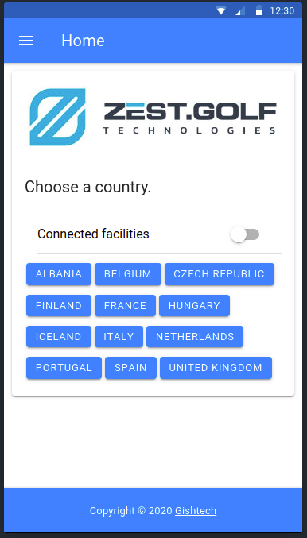

# Zest Golf Demo 

A simple mobile app based on Ionic which demonstrates using the Zest Golf API.



Install by doing the following:

```
$ git clone https://github.com/kgish/zest-golf-demo.git
$ cd zest-golf-demo
$ npm install
```

Fire up the mobile app:

```
$ ionic serve -lab
```

and then point your browser at the local lab: http://localhost:8200

The following pages are included:

* Login
* Home
* About
* Help
* Profile
* Help

The following shared components are included:

* Header
* Footer
* Hotels
* Side menu

The following functionalities are included:

* Authorization
* User model
* Page guard
* UI Service
* API Service
* Hotel Service

If a user is not logged in, he will be redirected to the login page automatically.

Have fun!

